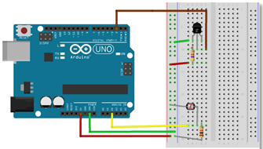
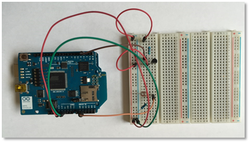

# Arduino Sample Code
Sample code for demonstrating simple data logging from DS18B20 Temperature Sensor and Analog photoresistor

Arduino UNO has both digital and analog input pins so we can just connect the sensors appropriate without any additional ADCs.

**Libraries** - This directory contains the necessary libraries for interfacing with the sensors

Place Arduino OneWire and dtc Library Folders in <your-path-to-Arduino-Directory>\libraries directory

**ArduinoSensorCodeDBEthnt** - This Arduino sketch sends HTTP GET requests to the Simple IoT platform via the RESTful API.

## Configure Server and IP Address
```C
har server[] = "cs50-final.mikevartanian.me";
byte mac[] = {  0x00, 0xAA, 0xBB, 0xCC, 0xDE, 0x01 };

// Note that this value needs to be set each time the router assigns a different address via DHCP
IPAddress ip(192,168,1,75);
```
Note that the IP address is dependant on the users address given via DHCP

## Create JSON String
```C
  // Configure the JSON string of temperature, light, and DeviceType values
  String JsonData = "{\"temp1\": \"";
  JsonData = JsonData + currentTemp;
  JsonData = JsonData + "\", \"photo1\": \"";
  JsonData = JsonData + outputValue;
  // Hardcoding user_id to 1 for now. This is user: test@test.com
  // Eventually would like a way to communicate from platform to device possibly using GET
  // command but beyond the scope for this final project  
  JsonData = JsonData + "\", \"user_id\": \"1\", ";
  // Hardcoding device_id to 1 for now. This is device: Arduino UNO - Test User 1
  // Eventually would like a way to communicate from platform to device possibly using GET
  // command but beyond the scope for this final project
  JsonData = JsonData + "\"device_id\": \"1\"}";
  ```
 Note that eventually I would like to dynamically change the user_id and device_id via the cloud platform. 

## POST JSON String to API
```C
  if (client.connect(server,80) == 1) {
    // HTTP requests are very picky on the format so pay attention
    // to everything including spaces!!
    client.println( "POST /api/sensordata.json HTTP/1.1");
    client.println( "Host: cs50-final.mikevartanian.me");
    client.println( "User-Agent: Arduino/1.0");
    client.println( "Accept: application/json");
    client.print( "Content-Length: ");
    client.println(JsonData.length());
    client.print( "Content-Type: application/json\r\n");
    client.println( "Connection: close");
    client.println();
    client.println(JsonData);
  }
  else {
    Serial.println("Disconnected");
  }
```

# Arduino UNO R3 Hardware Setup




# Tools / Software Used

For these examples, I was using an Arduino UNO R3 with an Ethernet shield with Arduino IDE 1.6.7 from https://www.arduino.cc/en/main/software running on a Windows 10 64 bit Dell Inspiron 13 7000 Series
