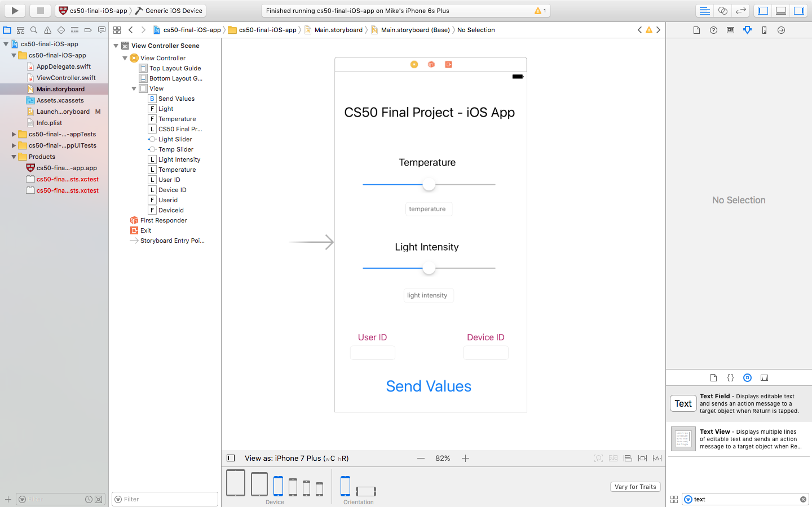
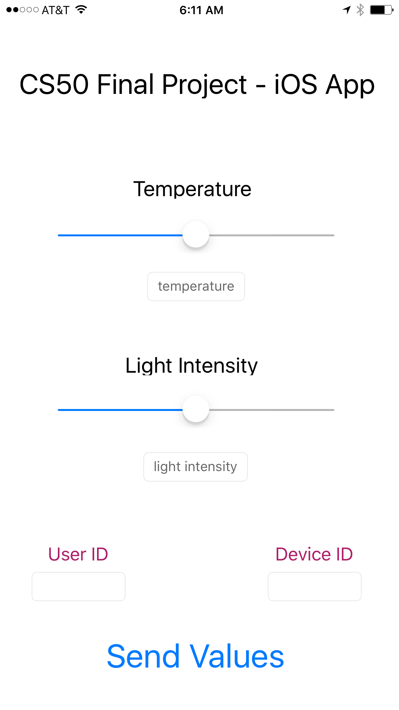

# cs50 iOS Application

# iOS App Screenshots

# Tools / Software Used

For this code, I was using an iPhone 6s Plus with iOS 9.3, and XCode 8 with Swift 3 running on a MacBook Pro (OS X El Capitan Version 10.11.6 15 inch Mid 2012)
