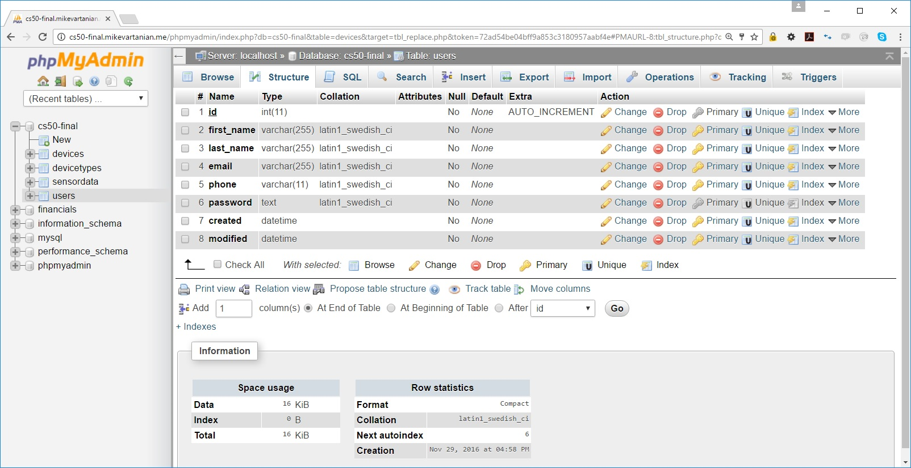

# PHP Source Code

Here is the source code used to generate the cloud platform. This is primarily driven by the CakePHP frameworks which are described a bit more below

## Login / Register
Users/visitors can only visit the home page, www.cs50-final.mikevartanian.me, without logging in. Any attempt to access subsites within the platform will be redirected to the login screen as shown below.


If the user does not have an account, this is easily accomplished through the Register form as shown below.

Note that the login link is only available if there is no user session while the Register/Logout links are only available if there is a user session available.

## Database
This simple IoT platform project utilizes a database with four (4) tables: users, devices, devicetypes, sensordata


### Users Table

### Devices Table

### Devicetypes Table

### Sensordata Table


# CakePHP Application Skeleton

[](https://travis-ci.org/cakephp/app)
[](https://packagist.org/packages/cakephp/app)

A skeleton for creating applications with [CakePHP](http://cakephp.org) 3.x.

The framework source code can be found here: [cakephp/cakephp](https://github.com/cakephp/cakephp).

## Installation

1. Download [Composer](http://getcomposer.org/doc/00-intro.md) or update `composer self-update`.
2. Run `php composer.phar create-project --prefer-dist cakephp/app [app_name]`.

If Composer is installed globally, run
```bash
composer create-project --prefer-dist cakephp/app [app_name]
```

You should now be able to visit the path to where you installed the app and see the default home page.

## Configuration

Read and edit `config/app.php` and setup the 'Datasources' and any other
configuration relevant for your application.

In order to get CakePHP 3.3 to work on the Digital Ocean server, I needed to enable the PHP intl extension using the following command:
> sudo apt-get install php5-intl
